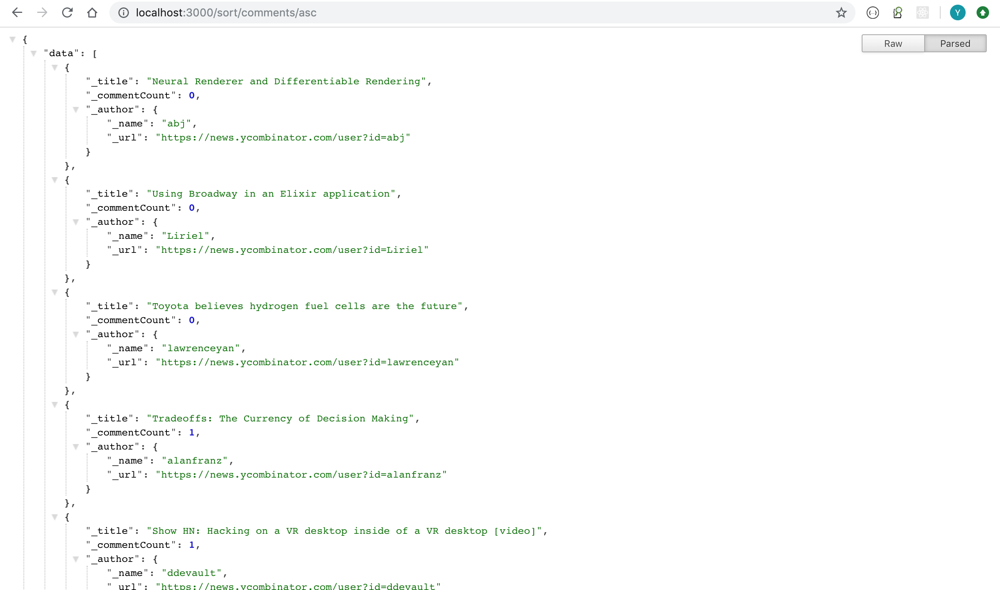
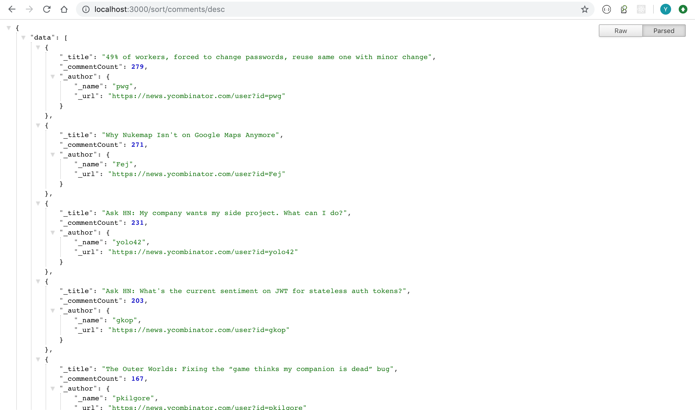
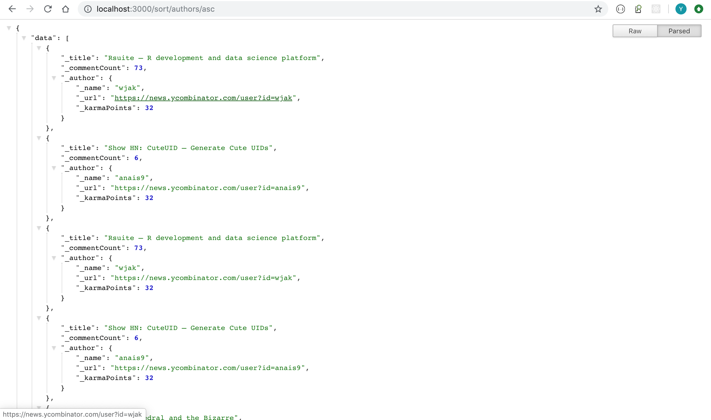
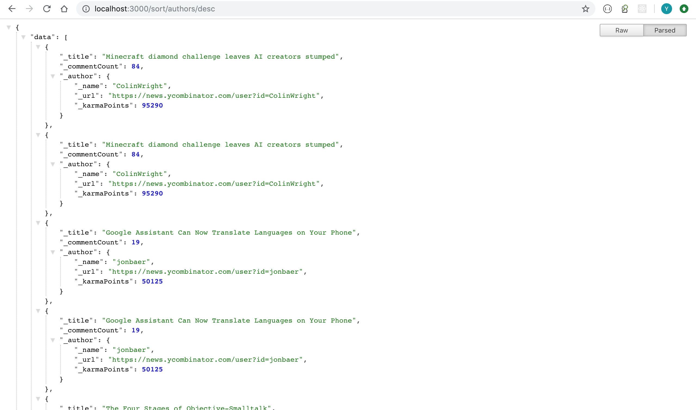

# Scrapping script in nodejs

This page will scrape `ycombinator` news page to get top stories and top authors based on `karmaPoints`.

# Code Structure:

- Our main server file that will host endpoints is `$PROJECT_ROOT/server.js`.
- A worker file which scrapes the webpage is `$PROJECT_ROOT/worker.js`.
- We have models for stories and authors inside `$PROJECT_ROOT/Models` directory.

# Steps to run

1. Make sure you have nodejs installed.
1. In the root directory, run `npm install` to install node modules.
1. To start the server run `node server.js`.

# Notes

1. To start the scraping process, hit the endpoint `localhost:3000/scrape`. Note that this will trigger scraping process in the background. You can check the server logs to check the progress. Also note that if you hit the endpoint again before earlier process stops, it will again run the scrapping task. This case is not handled due to brevity and can be handled by having a proper worker infrastructure or maintaining a state specifying whether we already started off the scraping task or not.
1. It will take some time to scrape the author pages as we are issuing sequential requests to avoid being blacklisted for DOS attack :).

# Endpoints

1. `localhost:3000/scrape` to initialize scraping.
1. `localhost:3000/sort/comments/asc` to get results in ascending order sorted by comment count.
1. `localhost:3000/sort/comments/desc` to get results in descending order sortted by comment count.
1. `localhost:3000/sort/authors/asc` to get results in ascending order sorted by author karma points.
1. `localhost:3000/sort/authors/desc` to get results in descending order sortted by author karma points.

# Caching results

- Please note that after scraping, the results are stored on a file called `output.json`. The above endpoints that sort the results will be based on the output saved in that file. So it won't be latest. To get recent list, please trigger scraping task again to fetch fresh results.

# Output

1. Sorted by comments ascending [comments_asc](./Output/comments_asc.png) 

1. Sorted by comments descending [comments_desc](./Output/comments_desc.png) 

1. Sorted by authors, ascending karma points [authors_asc](./Output/authors_asc.png)

1. Sorted by authors, descending karma points [authors_desc](./Output/authors_desc.png) 
